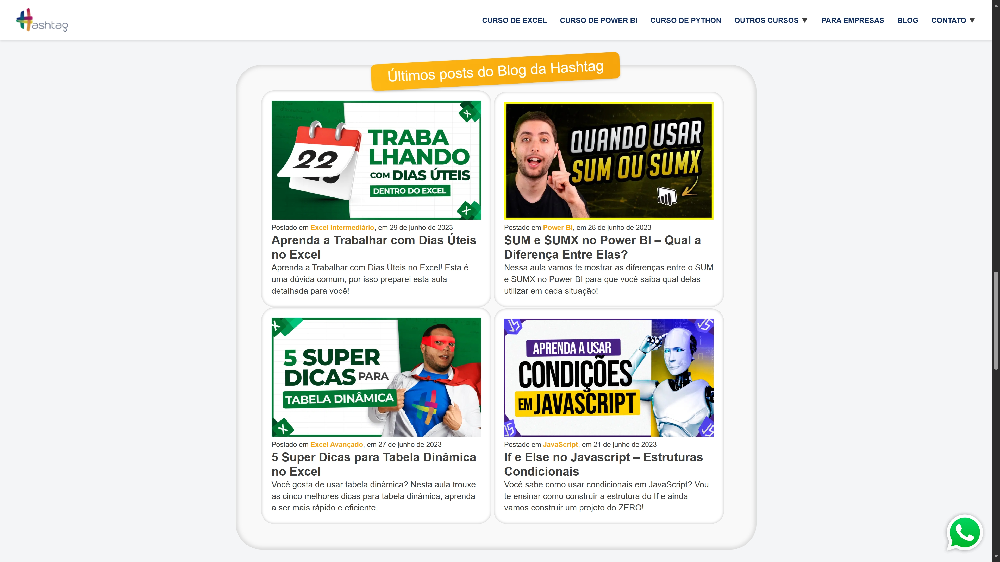
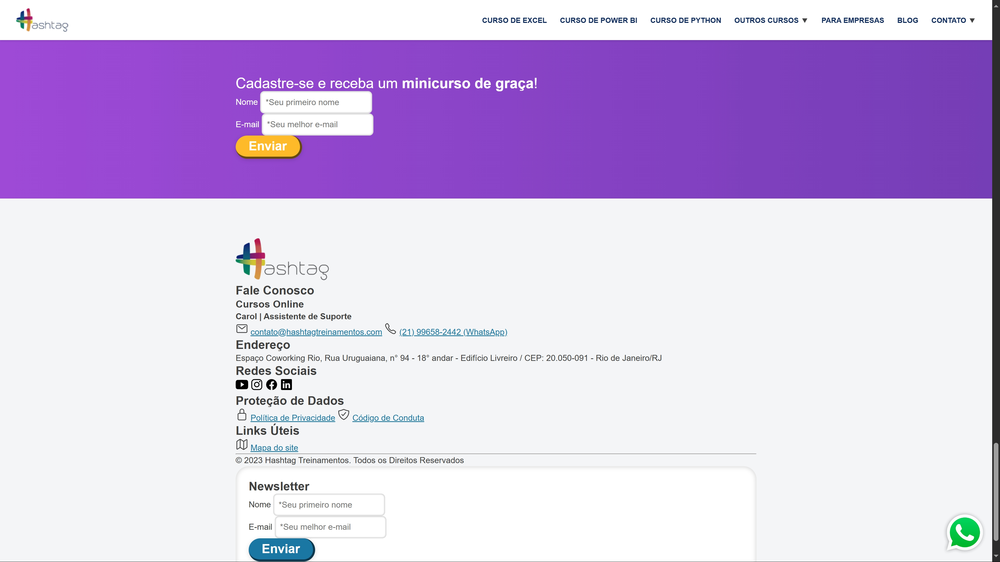

# 🌐 Réplica da Landing Page da Hashtag Treinamentos

## ℹ️ Nota Importante / Disclaimer

Este projeto é uma **réplica com fins educacionais e de estudo**, baseada na landing page oficial da [Hashtag Treinamentos](https://www.hashtagtreinamentos.com/).

Todo o design, conteúdo, logotipos e marcas exibidos pertencem integralmente à Hashtag Treinamentos. Não há qualquer afiliação oficial, endosso ou ligação comercial entre este projeto e a Hashtag Treinamentos.

Meu objetivo com esta réplica é puramente educacional: aplicar e consolidar os conhecimentos em HTML e CSS que estou adquirindo através dos cursos da Hashtag Treinamentos, praticando o desenvolvimento web em um cenário real.

---

## Sobre o Projeto

Olá! Sou Diego, estudante de programação e Inteligência Artificial, e este projeto é uma réplica da landing page oficial da **Hashtag Treinamentos**.

Meu principal objetivo ao desenvolver este repositório foi **colocar em prática e consolidar conhecimentos em HTML e CSS**, focando na estruturação de páginas web (`HTML5`) e na estilização completa (`CSS3`) de um layout real e complexo.

É um exercício prático que me permite aprofundar meu entendimento sobre:

- Estrutura semântica do HTML.
- Modelagem de caixas (Box Model).
- Seletores CSS e especificidade.
- Posicionamento de elementos (Flexbox, Grid, Position).
- Responsividade (apesar de ainda em desenvolvimento, a estrutura permite futuras implementações).
- Organização de código HTML e CSS.

## ✨ Funcionalidades Replicadas

Nesta réplica, foquei em reproduzir a estrutura visual e os estilos das seguintes seções da página original:

- **Cabeçalho (`<header>`):** Navegação principal, logo e links para cursos.
- **Seção Hero:** Título principal, parágrafo descritivo e botões de chamada para ação, incluindo o iframe de vídeo (visual apenas).
- **Seção Conteúdos Gratuitos:** Layout dos cards de cursos e mídias sociais.
- **Seção Diferenciais:** Apresentação dos pontos fortes da Hashtag, incluindo a grade de logos de empresas.
- **Seção "O que falam":** Estrutura para os depoimentos (carrossel visualmente replicado).
- **Seção "Na Mídia":** Logos de veículos de comunicação.
- **Seção Blog da Hashtag:** Layout dos posts recentes do blog.
- **Seção "Como a Hashtag pode te ajudar?":** Lista de benefícios e textos informativos.
- **Seção Minicurso:** Formulário simples de cadastro.
- **Rodapé (`<footer>`):** Informações de contato, links úteis, redes sociais e formulário de newsletter.

## 🚀 Tecnologias Utilizadas

- **HTML5:** Para a estrutura e conteúdo da página.
- **CSS3:** Para a estilização, layout e design.

_(**Nota:** O projeto foca primariamente em HTML e CSS. A interatividade e algumas funcionalidades do site original que dependem de JavaScript não foram implementadas nesta fase, mas a estrutura permite futuras adições.)_

## Screenshots

Aqui estão algumas capturas de tela da réplica. (Lembre-se que o visual pode variar um pouco dependendo da resolução e do navegador).

- **Visão Geral da Página:**
  
  _(Esta captura mostra o estado atual da réplica em tela cheia.)_

- **Detalhe da Seção Blog:**
  
  _(Foco na replicação do layout dos posts recentes do blog.)_

- **Detalhe do Rodapé da Página:**
  
  _(Demonstração da estrutura e elementos replicados no rodapé.)_

## ⚙️ Como Visualizar o Projeto

Para visualizar este projeto em seu ambiente local, siga os passos abaixo:

1.  **Clone o repositório:**
    ```bash
    git clone https://github.com/Diegocjc26/html-css-hashtag-study.git
    ```
2.  **Navegue até o diretório do projeto:**
    ```bash
    cd html-css-hashtag-study
    ```
3.  **Abra o arquivo `index.html`:**
    Simplesmente abra o arquivo `index.html` em seu navegador web preferido (Chrome, Firefox, Edge, etc.). Não é necessário um servidor web para a maioria das funcionalidades.

## Próximos Passos e Melhorias Futuras

Como um projeto de estudo em andamento, há sempre espaço para melhorias! Algumas ideias para o futuro incluem:

- Implementar a responsividade completa para diferentes tamanhos de tela (mobile, tablet).
- Adicionar interatividade com JavaScript (ex: menu hambúrguer para mobile, carrosséis funcionais, validação de formulários).
- Otimização de performance e acessibilidade.
- Refatorar o CSS para metodologias como BEM ou SMACSS.

## 🧑‍💻 Autor

- **Diego**
- **GitHub:** [Link para seu perfil do GitHub, ex: `https://github.com/Diegocjc26`]
